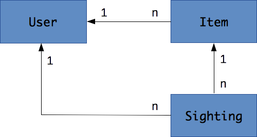

# Projects

These are a few suggestions of projects to develop for the course.

* [Crowdfind](#crowfind)
* [Travel log](#travel-log)
* [Trip advisor](#trip-advisor)
* [Other](#other)

## Crowdfind

Ask the community to find where you can buy something.

## Travel log

Take pictures of places along your trip.

## Trip advisor

Find and rate places to eat, sleep or visit.

## Other

Other ideas can be accepted as long as they meet the [evaluation criteria](README.md#evaluation).
You may find inspiration there:

* [Idea Machine](http://www.ideamachine.io/#view-ideas-top)
* [Ideas Watch](https://www.ideaswatch.com/startup-ideas/app)
